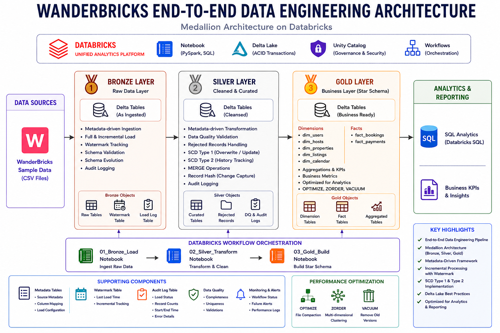
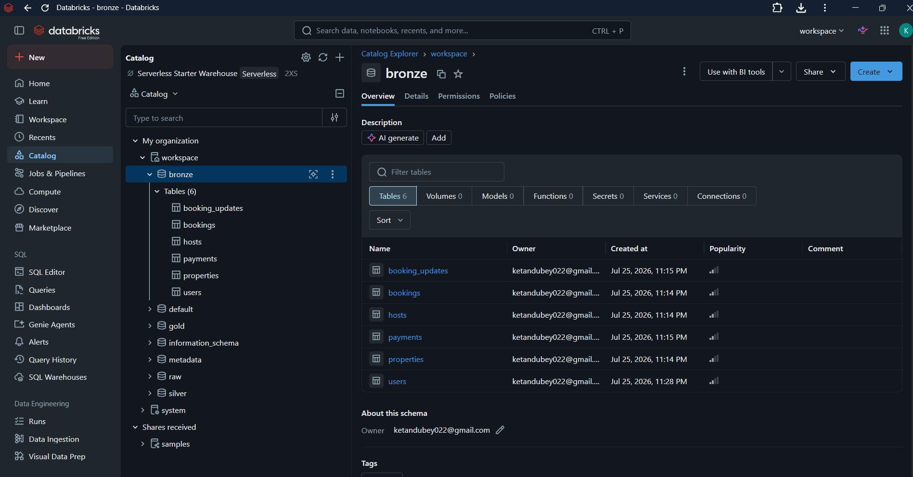
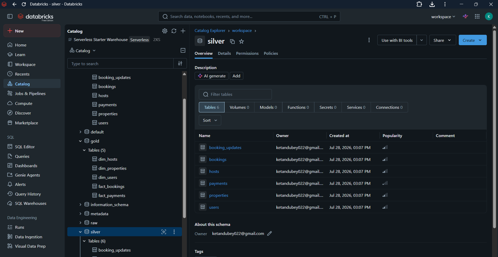
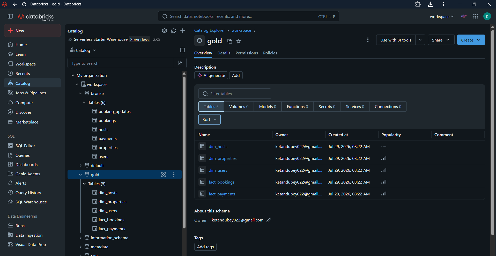

# WanderBricks End-to-End Data Engineering Project

## Project Overview

This project demonstrates the design and implementation of an end-to-end data engineering pipeline on Databricks using the Medallion Architecture (Bronze, Silver, and Gold).

The pipeline ingests raw WanderBricks data, performs metadata-driven transformations, applies data quality checks, implements Slowly Changing Dimensions (SCD Type 1 & Type 2), and creates curated business-ready dimension and fact tables for analytical reporting.

The solution also includes incremental data processing, schema validation, schema evolution, Delta Lake optimizations, SQL analytics, and Databricks Workflow orchestration.

## Business Problem

WanderBricks is a vacation rental platform that generates data from users, hosts, properties, bookings, and payments. As the business grows, transactional data becomes scattered across multiple tables, making reporting and analytics increasingly complex.

Business teams need quick access to insights such as monthly revenue, booking trends, host performance, payment success rate, and property utilization. Querying raw operational data directly is inefficient, difficult to maintain, and does not scale as data volume increases.

This project addresses these challenges by building an end-to-end Data Engineering pipeline using the Medallion Architecture. The solution ingests raw data, performs data quality validation, supports incremental processing, preserves historical changes with SCD Type 2, and transforms the data into analytics-ready Gold tables optimized for business reporting.

## Business Value

- Centralized raw operational data into a scalable analytics platform.
- Reduced the complexity of reporting by creating business-ready Gold tables.
- Enabled efficient incremental data processing using Delta Lake MERGE.
- Preserved historical changes using SCD Type 2.
- Improved analytical query performance using OPTIMIZE, ZORDER, and VACUUM.
- Provided a Star Schema for efficient SQL analytics and dashboarding.

## 🛠️ Technology Stack

| Category | Technologies |
|----------|--------------|
| Data Processing | Apache Spark (PySpark), SQL |
| Platform | Databricks (Unity Catalog, Workflows) |
| Storage | Delta Lake |
| Programming | Python, SQL |
| Data Architecture | Medallion Architecture (Bronze, Silver, Gold) |
| Data Modeling | Star Schema |
| Data Engineering | Metadata-Driven ETL, Incremental Loading, Watermarking |
| Optimization | Delta MERGE, OPTIMIZE, ZORDER, VACUUM |
| Version Control | Git & GitHub |

## 🏗️ Solution Architecture

## 🔄 Project Workflow

The project follows a Medallion Architecture (Bronze → Silver → Gold) to transform raw WanderBricks data into analytics-ready datasets.

### Step 1 – Bronze Layer
- Ingest raw WanderBricks CSV data into Delta tables.
- Perform metadata-driven ingestion.
- Support both Full Load and Incremental Load.
- Track watermarks for incremental processing.
- Validate incoming schema and support schema evolution.
- Maintain audit logs for every pipeline execution.

### Step 2 – Silver Layer
- Clean and standardize raw data.
- Apply data quality validations.
- Store rejected records separately.
- Implement SCD Type 1 and SCD Type 2.
- Perform Delta MERGE operations.
- Generate record hashes for change detection.
- Capture audit information.

### Step 3 – Gold Layer
- Build business-ready Star Schema.
- Create Dimension and Fact tables.
- Execute business SQL analytics.
- Optimize Delta tables using OPTIMIZE, ZORDER, and VACUUM.
- Publish analytics-ready datasets for reporting.

### Step 4 – Workflow Orchestration
Databricks Workflows orchestrate the complete pipeline by executing the notebooks in the following order:

Bronze_Load → Silver_Transform → Gold_Analytics

## 🥉 Bronze Layer

The Bronze Layer is responsible for ingesting raw WanderBricks data into Delta Lake while preserving the original data. This layer is designed to support scalable and reliable ingestion with metadata-driven processing.

### Features

- Metadata-driven ingestion framework
- Full Load & Incremental Load
- Watermark-based processing
- Schema Validation  (### Schema Handling Validates incoming source schema against the existing Bronze table. Detects missing columns and data type changes before   loading data.Supports automatic addition of new columns using Delta Lake `mergeSchema`.)
- Schema Evolution
- Audit Logging
- Delta Lake storage

### Processing Flow

WanderBricks CSV Files
        ↓
Metadata Validation
        ↓
Schema Validation
        ↓
Incremental / Full Load
        ↓
Bronze Delta Tables
        ↓
Audit Log Update

### Bronze Output

- Raw Delta Tables
- Watermark Table
- Audit Log Table

### Screenshot

## 🥈 Silver Layer

The Silver Layer transforms raw Bronze data into clean, standardized, and analytics-ready datasets. This layer applies business rules, data quality checks, and Slowly Changing Dimension (SCD) techniques to ensure reliable and consistent data.

### Features

- Metadata-driven transformation framework
- Data Quality Validation
- Rejected Records Handling
- SCD Type 1 (Overwrite / Update)
- SCD Type 2 (History Tracking)
- Delta MERGE Operations
- Record Hash for Change Detection
- Audit Logging

### Processing Flow

Bronze Delta Tables
        ↓
Data Cleaning & Standardization
        ↓
Data Quality Validation
        ↓
SCD Type 1 / SCD Type 2
        ↓
Delta MERGE
        ↓
Silver Delta Tables

### Silver Output

- Cleaned Delta Tables
- Rejected Records
- Audit Log Table

### Screenshot

## 🥇 Gold Layer

The Gold Layer delivers business-ready datasets by transforming curated Silver data into a Star Schema optimized for analytical reporting and SQL-based business insights.

### Features

- Star Schema Data Model
- Dimension & Fact Tables
- Business KPIs & Analytics
- SQL-based Reporting
- Delta Lake Performance Optimization
- Analytics-ready Data

### Data Model

Dimensions
- dim_users
- dim_hosts
- dim_properties

Facts
- fact_bookings
- fact_payments

### Business Analytics

The Gold Layer provides business-ready datasets for analyzing:

- Total Revenue
- Total Bookings
- Average Booking Value
- Average Stay Duration
- Monthly Revenue Trends
- Booking Status Distribution
- Payment Success Rate
- Weekend vs Weekday Bookings
- Revenue Growth Analysis
- Top Performing Properties

### Performance Optimization

- OPTIMIZE
- ZORDER
- VACUUM

These optimizations reduce file fragmentation, improve data skipping, and enhance query execution performance on large datasets.

### Gold Output

- Star Schema
- Business-ready Delta Tables
- Optimized Analytics Tables

### Screenshot

## ⚡ Performance Benchmark

> **Note:** These benchmark results were measured on the WanderBricks sample dataset. While Delta Lake optimizations already improved query performance by up to **17.1%**, the benefits of techniques such as **OPTIMIZE**, **ZORDER**, and **VACUUM** typically become more significant as dataset size and file volume increase. On larger production-scale datasets, these optimizations generally provide greater reductions in query execution time.

Delta Lake optimization techniques (OPTIMIZE, ZORDER, and VACUUM) were applied to improve query execution performance on Gold tables.

| Query | Before | After | Improvement |
|-------|--------:|-------:|------------:|
| Monthly Revenue | 1.580 s | 1.487 s | **5.9% Faster** |
| Property Revenue | 2.003 s | 1.872 s | **6.5% Faster** |
| Property Type Revenue | 1.950 s | 1.688 s | **13.4% Faster** |
| Top 10 Hosts | 2.158 s | 1.788 s | **17.1% Faster** |

### Optimization Techniques

- OPTIMIZE (File Compaction)
- ZORDER (Data Skipping)
- VACUUM (Old File Cleanup)

### Key Outcome

- Improved query execution performance by **up to 17.1%** after Delta Lake optimization.
- Reduced file fragmentation and enhanced data skipping for analytical workloads.

Author : Ketan Dubey

 

